Teamcity 세팅은 추후 글을 작성하도록 한다.

먼저 새로운 프로젝트를 생성해줌.
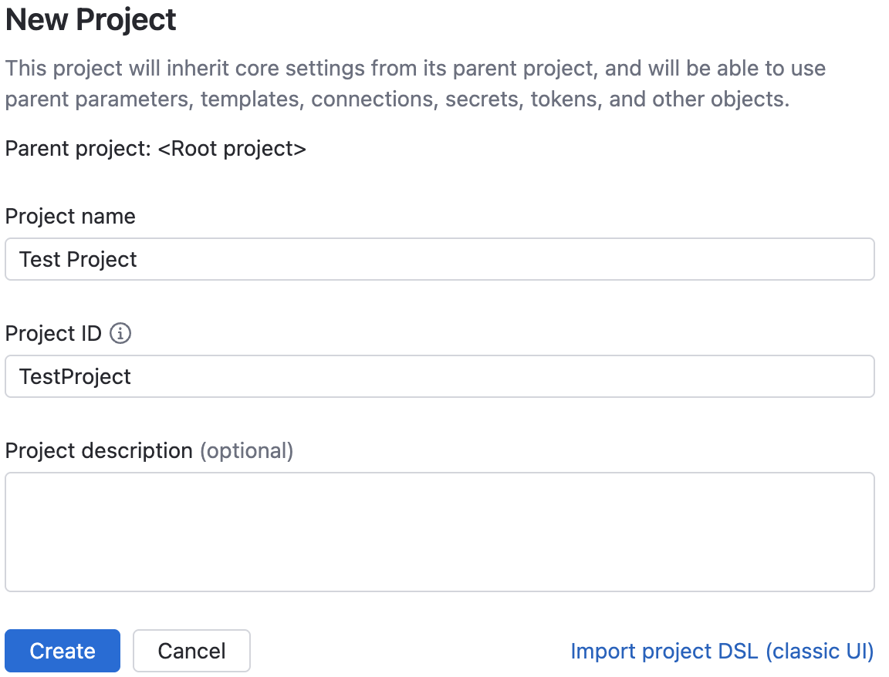
빌드 구성(Build configuration)과 파이프라인(Pipeline)중 선택이 가능한데, 파이프라인은 따로 신청해야 사용이 가능하기 때문에 빌드 구성으로 진행.
이전에 Github 계정을 연결했기 때문에 사용할 레포를 선택 후 세부 설정을 진행한다.
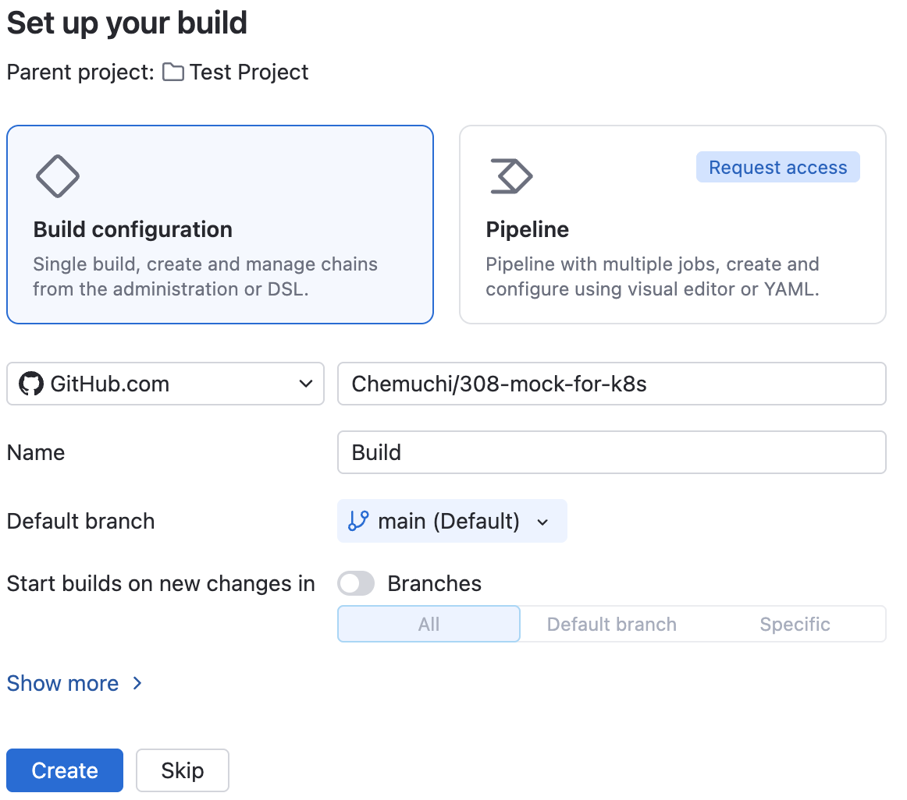
- Teamcity 테스트 및 적응을 위해 임시로 만든 목업 프로젝트로 진행한다

목업 프로젝트는 하나의 레포에 Frontend와 services/coupon-service, services/user-service 가 나누어져 있기 때문에, 서브 프로젝트로 먼저 쿠폰 서비스만 나누어 주었다.
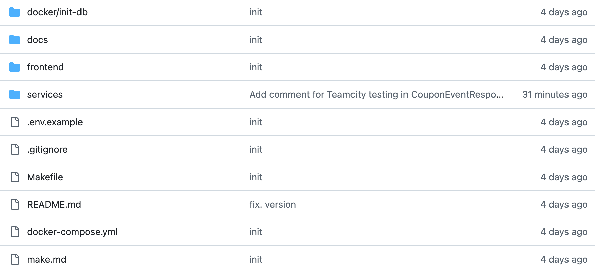
- 목업 프로젝트의 디렉토리 구조 모습

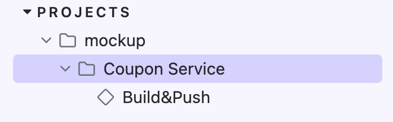
- 글 작성전에 미리 해본 구조

프로젝트를 만들고 빌드 구성을 완료하면 자동으로 빌드 스탭을 감지하여 보여준다.
하지만 이건 사용하지 않고, 따로 구성해서 사용할 예정임.

일단 흐름은 다음과 흘러가도록 할 예정
커밋감지 -> 설정한 트리거인가 -> 맞으면 빌드 진행 -> 빌드 후 ECR로 푸시

그러니 우선 커밋을 감지하는 기능부터 설정해야할텐데, Github 레포를 연결해놨기에 자동으로 Teamcity에서 감지하도록 설정을 해준다.

빌드 구성을 보면 General, Version Control, Build Step 등등 있는데, 여기서 Version Control에 들어간다.
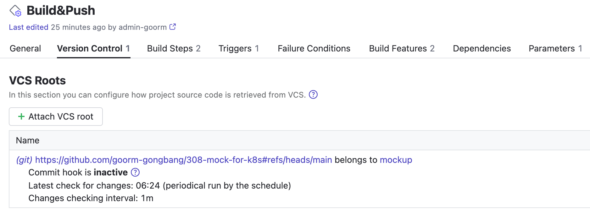
- 이미지를 보면 Changes checking interval: 1m 이라고 써있는데, 이는 1분마다 Github의 변경사항을 감지한다는 말

그럼 이제 두번째로 트리거를 설정할 차례이다.
services/coupon-service 안의 내용이 변경되었을 경우에만 빌드 스탭이 진행되도록 할것이다.

위의 이미지에 나오는 Triggers 탭으로 이동해 + Add new trigger 버튼을 클릭한다.
그러면 Add New Trigger 라는 탭이 나오고, 트리거를 선택하라고 하는데, 여기서 VCS Trigger를 선택한다.
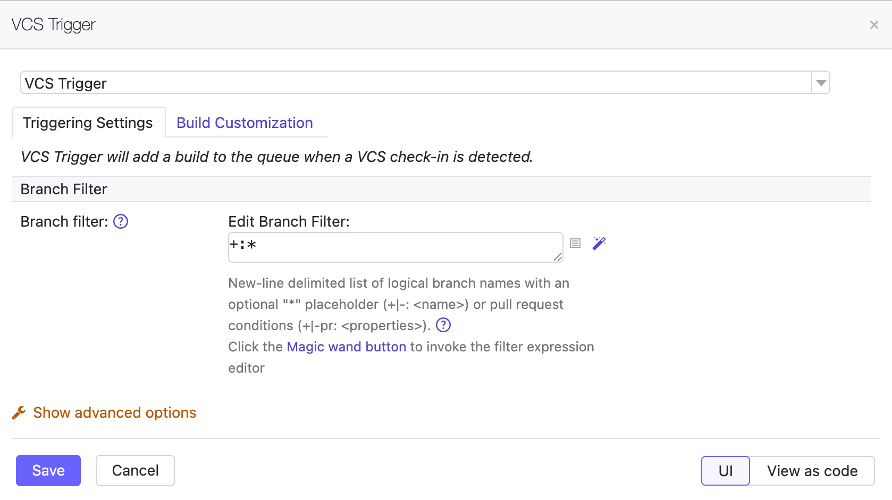

기본적으로 브랜치관련 설정만 나올텐데, 좌하단의 Show advanced options를 선택하면 추가적인 설정이 나오게 된다.
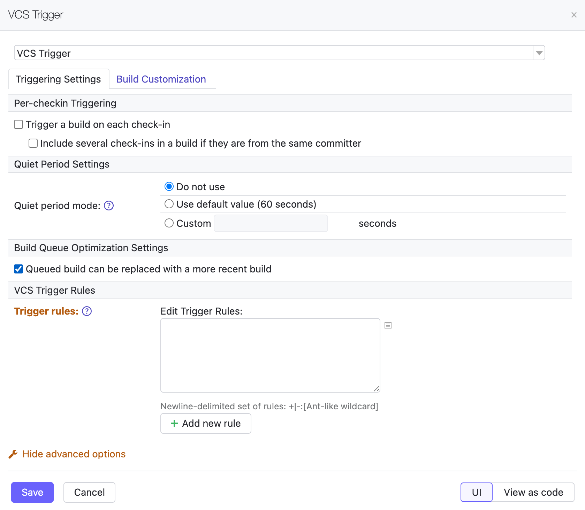
여기서 하단에 있는 + Add new rule 를 클릭한다.
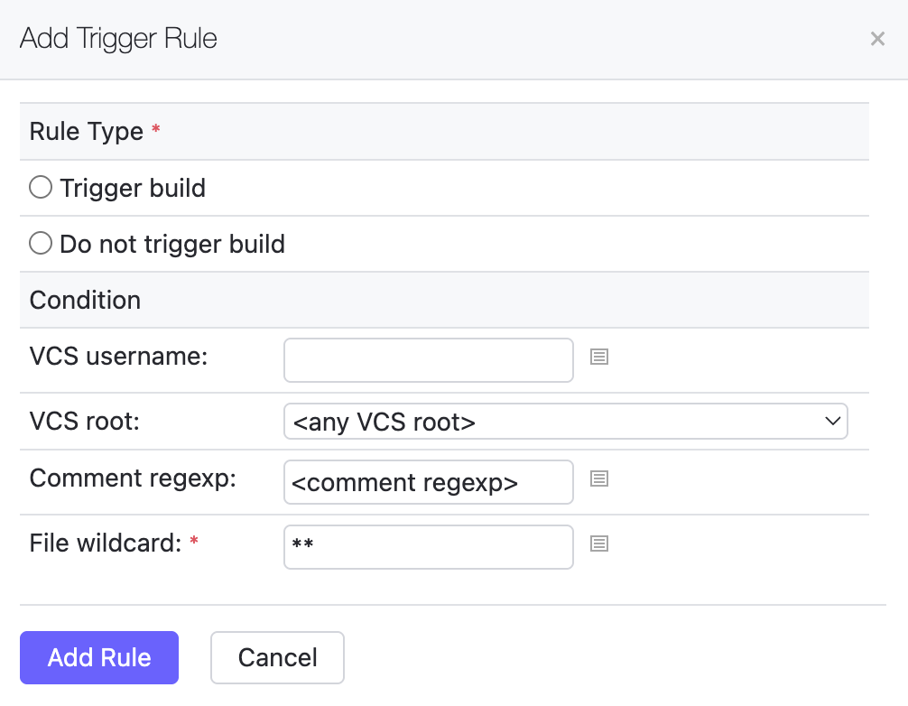
나는 빌드가 작동해야 하니 Rule Type은 Trigger Build 로 설정해주고, 
VCS username은 아마 특정 사용자의 커밋을 트리거해주는게 아닐까..싶고
VCS root는 작업할 레포를 선택해주는건데 일단 누르면 나오는 레포로 설정
그리고 중요한게 File wildcard 설정이다.

프로젝트 구조를 보면 다음과 같은데,
```
.
├── docker/
│   └── init-db/
├── docs/
├── frontend/
├── services/
│   └── coupon-service/ <-- 여기에 Dockerfile 있음
│   └── user-service/
├── .env.example
├── .gitignore
├── Makefile
├── README.md
├── docker-compose.yml
└── make.md
```
나는 services/coupon-service 내의 파일들에 변경사항이 생겼을 때, 빌드가 진행되도록 해야하니 File wildcard를 `**/coupon_service/**`로 설정한다.
Wildcard 세팅 관련 해서는 [공식 문서](https://www.jetbrains.com/help/teamcity/wildcards.html)를 참고하자.

위에 작성한건 상위 폴더 상관없이 coupon_service내의 모든 파일 변경사항을 감지하도록 하는 설정이다.

저장하고 이제 Build Feature 탭에서 + Add build feature 를 누르고, Docker Registry Connections 를 선택한다.
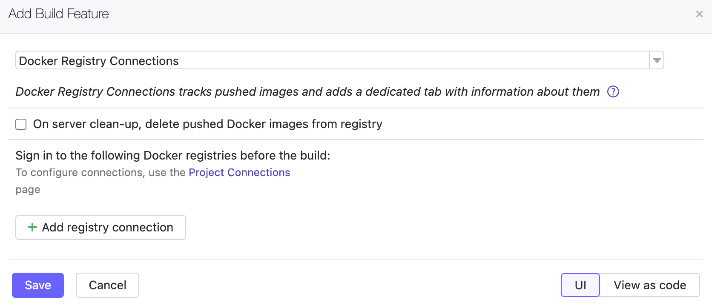
여기서 + Add registry connection 을 눌러도 아무것도 뜨지 않는다. 먼저 프로젝트에 ECR을 연결시켜주는 작업이 필요하기 때문이다.
하이라이트된 Project Connections 을 눌러 창을 이동한다.

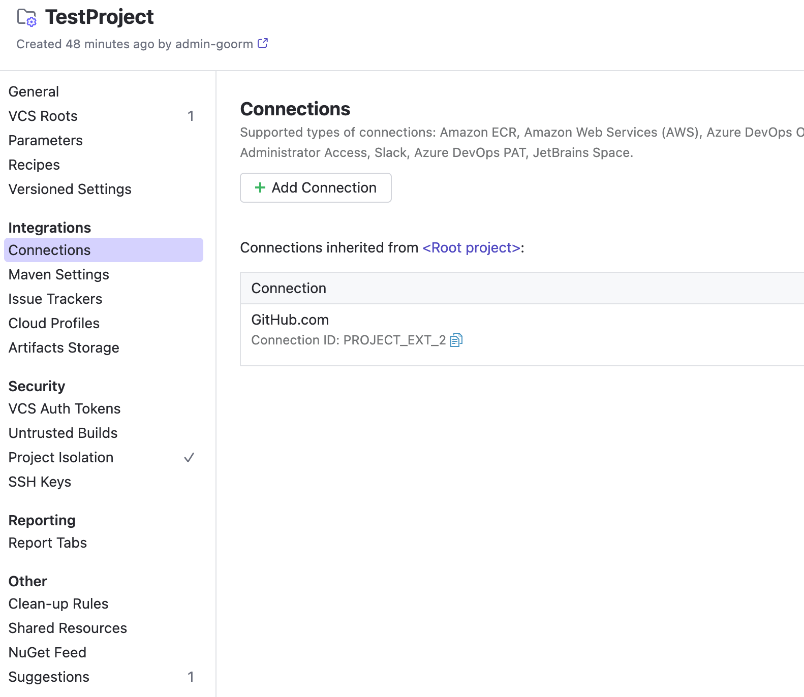
이동하면 이런 창이 뜰텐데, 여기서 + Add Connection 을 누르고 나오는 탭에서 Connection Type 을 Amazon ECR로 정한다.(AWS 와 ECR 관련된 내용은 스킵.... )
나는 IAM 사용자를 만들고, `AmazonEC2ContainerRegistryPowerUser` 정책만 부여하였다.

아무튼 타입까지 설정하면 탭이 다음과 같이 변할텐데, 
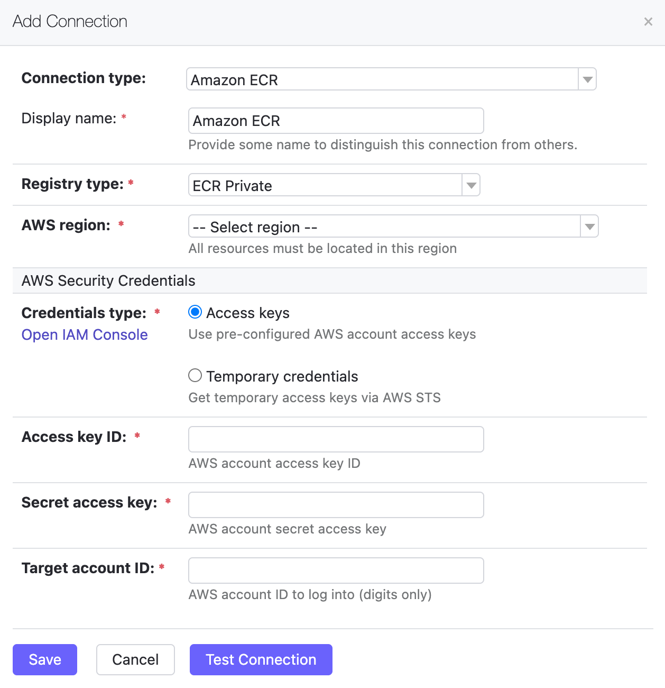
AWS region은 사용할 버킷의 리전
Access Key ID는 Teamcity가 사용할 사용자의 ID
Secret access key는 Teamcity가 사용할 사용자의 시크릿
Target account ID는 계정 ID (1234-5678-9101)을 넣어준다

그리고 Test Connection을 눌러 연결을 테스트한다.
문제가 있다면 AWS region 칸에, 문제없이 연결에 성공하면 Test Connection 이라는 탭이 뜨며 Connection successful! 이라고 뜬다.

연결이 되었다면 Save를 눌러 저장해준다.

다시 Build Features 로 돌아와 + Add build feature를 눌러 Docker Registry Connections 를 선택해 + add registry connection을 누르면 기존과 달리 Amazon ECR이 뜰것이다.
Add 를 눌러 제대로 들어갔는지 확인 후 Save를 누른다.
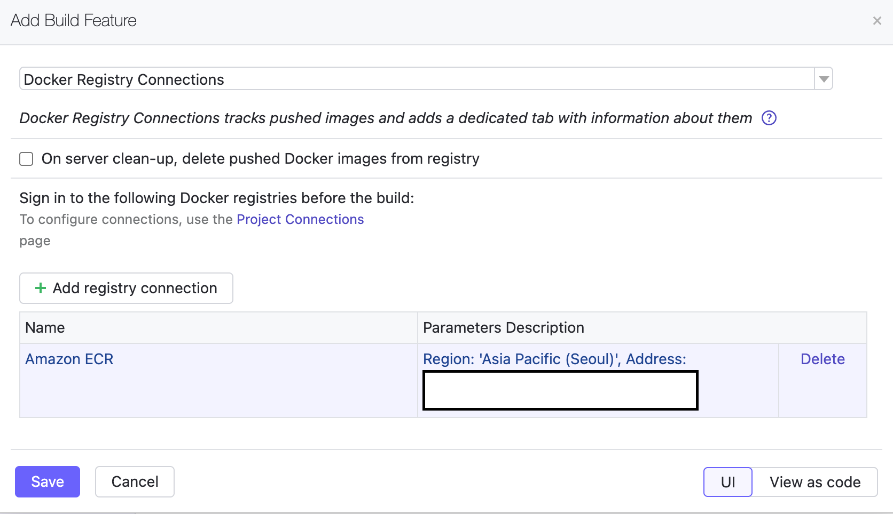

이제는 Build Steps에 가서 설정을 해야한다.
들어가서 + Add Build step을 클릭한다.
여러가지 중 나는 Command Line을 사용하여 빌드를 할 예정이다.
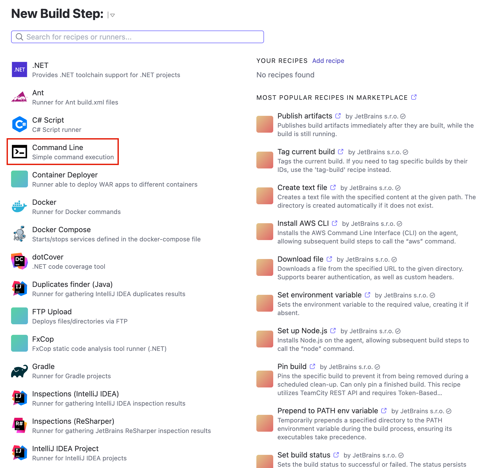
들어가면 이러한 창이 뜰텐데, 내용은 다음과 같다. (사진은 고급 설정이 보이는 상태)
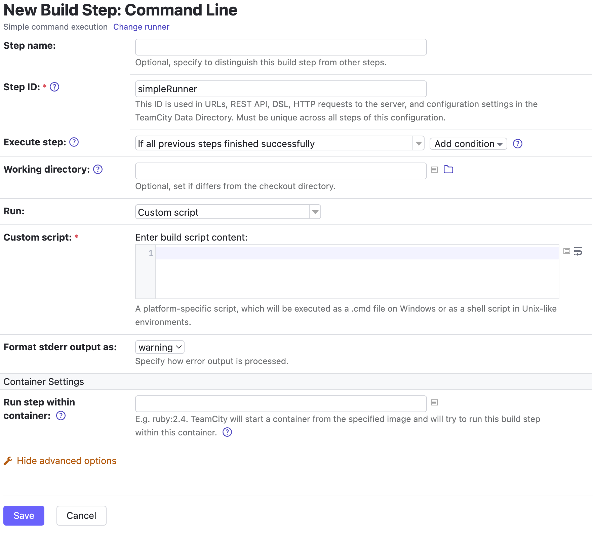
- Step name: 빌드 이름을 지정한다.
- Step ID: 이경우엔 자동적으로 Step name에 따라 지정된다
- Execute step: 빌드 발동 기준
- Working directory: 작업 디렉토리를 설정하는 옵션인데, 여기서는 coupon-service를 위해 Dockerfile 을 사용해 이미지를 빌드할것이기 때문에 services/coupon-service로 Dockerfile이 위치한 디렉토리를 잡아준다.
- Custom script: 스크립트를 작성하는데, 나는 아래와 같이 작성하였다.
```bash
# 에러 발생시 멈춤. 이게 없으면 중간에 에러가 나도 Teamcity가 성공적으로 빌드하였다고 생각한다.
set -e 

IMAGE_URI="%env.ECR_URI%"
TAG_NUMBER="%teamcity.build.id%"
FULL_NAME="${IMAGE_URI}:${TAG_NUMBER}"

echo "-----------------------------------------"
echo " > 빌드정보"
echo " 	 - Image: ${FULL_NAME}"
echo "-----------------------------------------"

echo " > 빌드 시작"
docker build -t "$FULL_NAME" .

echo " > 모든 빌드 과정 완료"
```

저장하고 나간 후 스크립트에서 사용한 ECR_URI 값을 설정해준다.
General, Version Control 등이 있는 탭에서 Parameters 를 클릭해 들어간다.

\+ Add new parameter 를 누르면 창이 뜨는데, 여기에 설정을 해준다.

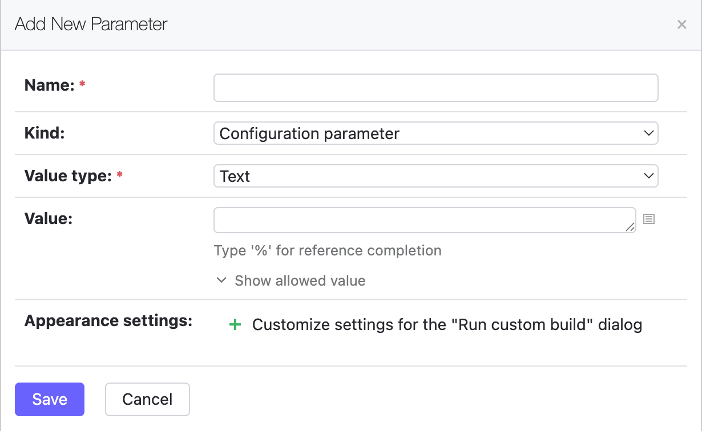
- Name: 변수 이름을 넣는 곳인데, 앞에 env. 를 붙이면 Kind 까지 자동으로 설정된다.
- Value type: 값의 타입을 설정하는데, 여기선 엄청 중요한 정보를 담을것이 아니기 떄문에 Text로 설정한다.
- Value: 값을 넣는 곳인데, 여기선 사용할 ECR의 링크를 넣어준다.
	- `xxxxxxxxxxx.dkr.ecr.ap-northeast-2.amazonaws.com/mockup/coupon-service` 형식으로 넣어준다.

다시 Build Steps 로 돌아와 이번엔 ECR에 Push 할 과정을 설정한다.
나는 아래와 같이 설정하였다.
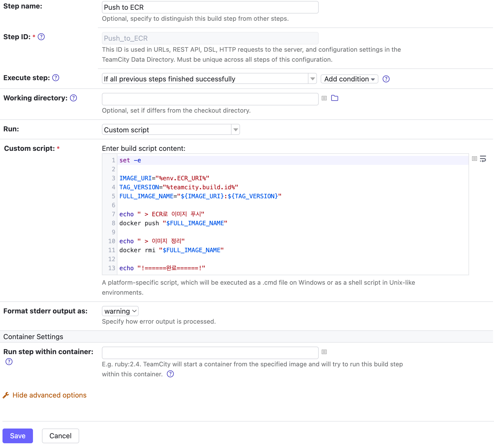
```bash
set -e

IMAGE_URI="%env.ECR_URI%"
TAG_VERSION="%teamcity.build.id%"
FULL_IMAGE_NAME="${IMAGE_URI}:${TAG_VERSION}"

echo " > ECR로 이미지 푸시"
docker push "$FULL_IMAGE_NAME"

echo " > 이미지 정리"
docker rmi "$FULL_IMAGE_NAME"

echo "!======완료======!"
```

이제 빌드 설정은 모두 끝났으니 테스트를 해볼 시간이다.

레포지토리안의 coupon-service 파일에 들어가 아무 파일이나 수정하고 커밋을 해보았다.
잠시 후 Pending changes에 변경사항이 떴고, Agent가 바로 받아 일을 하기 시작했다.
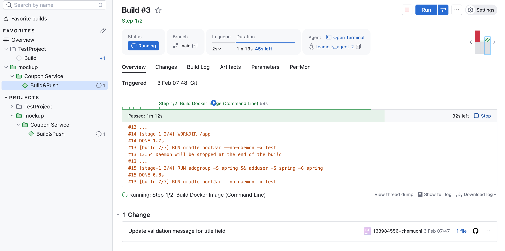

모든 과정이 완료된다면 게이지 창에서 Step 1/2 와 Step 2/2 로 나누어진걸 볼 수 있다.
각 과정을 누르면 로그를 볼 수 있는데 정상적으로 Push 까지 완료된걸 볼 수 있다.

실제로도 ECR에 들어가보면 실제로 이미지가 들어간것을 볼 수 있다!
이렇게 Teamcity에 레포를 연결하고, 특정 변경사항이 생겼을때만 빌드 작업을 진행하도록 하는 방법을 알아볼 수 있었다.
