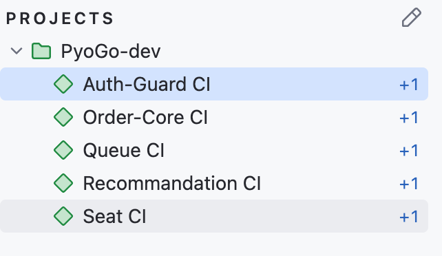
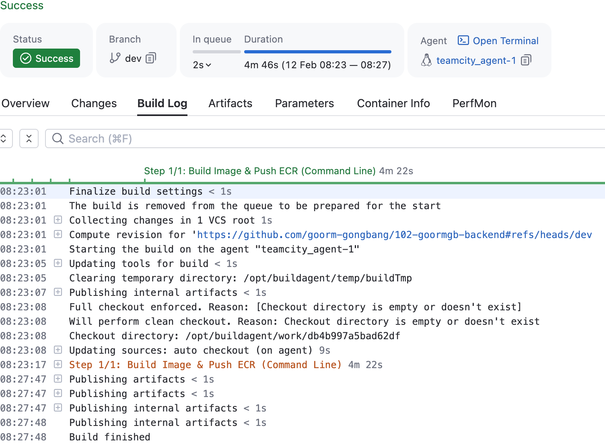

## 오늘 한일

### Docker Compose 작업
개발팀을 위해 기존 docker-compose.yml 파일 수정하여 모든 서비스들이 DB와 같이 생성되도록 하였음

생성 되는거만 확인하였고, 실제로 통신이 되는지 확인은 따로 필요

현재 arm64 아키텍처로만 빌드하여 사용하도록 docker-compose.yml이 작성되어있음.

## Teamcity로 Dev CI 환경 구축
백엔드 레포에서 Dev 브랜치에 커밋시 이미지 빌드 후 ECR에 배포하는 Teamcityt CI 를 구축함.  
변경사항이 있고, 변경사항이 생긴 파일과 폴더에 따라 다른 빌드 스크립트가 돌아가도록 설정.



빌드 스크립트는 다음과 같이 작성

```bash
#!/bin/bash
set -e

# [설정] --------------------------------------------------------
SERVICE_NAME="<서비스명>"
DOCKERFILE_PATH="<Dockerfile 경로>"

# TeamCity 변수
IMAGE_URI="%env.ECR_REPOSITORY_URL%"
TAG_VER="%build.number%"

# 커밋 해시 (Short Hash)
SHORT_HASH=$(echo "%build.vcs.number%" | cut -c 1-7)

# 최종 이미지 태그 조합 (예:a1b2c3d)
TAG="${SHORT_HASH}"
FULL_IMAGE_NAME="${IMAGE_URI}:${TAG}"

echo "------------------------------------------------------"
echo "▶ Build Info"
echo "  - Service  : ${SERVICE_NAME}"
echo "  - Dockerfile: ${DOCKERFILE_PATH}"
echo "  - Target Tag: ${TAG}"
echo "------------------------------------------------------"

# 1. Docker Build
echo "▶ Starting Docker Build..."
docker build -f "$DOCKERFILE_PATH" -t "$FULL_IMAGE_NAME" .

# 2. Push to ECR
echo "▶ Pushing to ECR..."
docker push "$FULL_IMAGE_NAME"

# 3. Cleanup
echo "▶ Cleaning up local image..."
docker rmi "$FULL_IMAGE_NAME"

echo "✅ Build & Push Completed!"
```



### 팀별 Teamcity 접근 계정 생성
클라우드 네이티브(본인)팀은 개인 계정 + 어드민 권한  
백엔드팀은 공용 계정 + Read Only

아쉬운건 세세한 권한 설정(AWS IAM 권한 설정마냥)은 없는거 같아 아쉬움  


## 예정된 할일
### Dev 환경에 ArgoCD 구축
### 민감정보 관리
다음와 같이 설계를 해보았다
1. 테라폼으로 공용환경으로 S3 버킷 생성
2. 생성된 버킷에 .env 파일 업로드
3. 테라폼에 모듈로 SSM Parameter Store 또는 Secrets Manager 모듈 추가
4. dev/staging/prod 환경에 맞게 SSM Parameter Store 또는 Secrets Manager를 생성하도록 함
    + 여기서 키는 직접 생성, 값은 S3에 저장된 .env 참조하도록